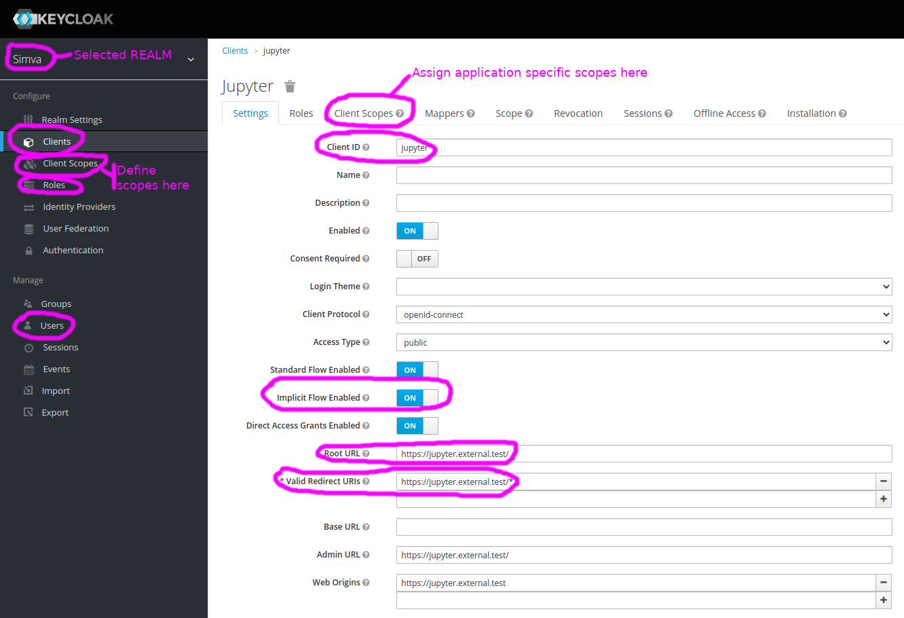
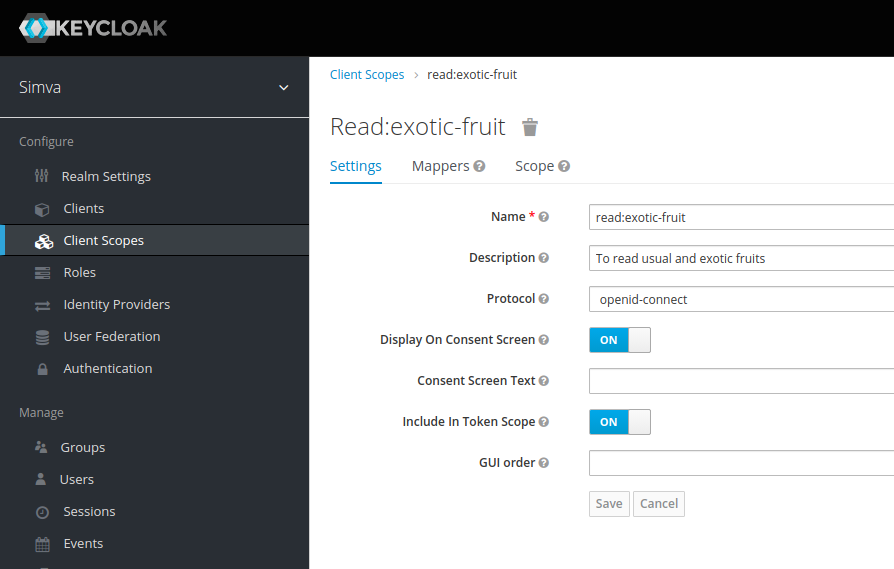

# Keycloak

## Overview

To use [Keycloak](https://www.keycloak.org/) as an authentication server you must:
+ Install / have access to a Keycloak server.
+ Create a client, and at least a user - see [Config](#config) section
+ This info is necessary to instantiate a `ParamsKeycloak` object - see [Params](#params) section

To test it you must:
+ Run the demo API - see [Demo](#demo) section


## Params

The following params are expected to instantiate a `ParamsKeycloak` object. Some or all of these params can be made available in a dotenv file. If params are input via the dotenv file and directly, then the latter prevails. 

### response_type

+ type: `string`

This must be `id_token token` as only the implicit flow is supported and the id_token is required for user data.

### base_url

+ type: `string`

It is the base URL to access the Keycloak server (e.g. `https://keycloak.example.org`, `http://localhost:8080`).

### realm

+ type: `string`

It is the realm name in Keycloak where the OIDC client belongs (e.g. `master`, `myapp`).

### client_id

+ type: `string`

The Keycloak Application Client ID field.

### redirect_uri

+ type: `string`

A URI that is listed in an Keycloak Application Allowed Callback URLs.  
**IMPORTANT**: it must be `host:port/callback/` where `host:port` are your notebook servers'.

### audience

+ type: `string`

The Keycloak Name field of an API.

### scope

+ type: `string`
+ default: `profile` and `openid` are automatically added

A space separated list of requested scopes.

### dotenv_folder

+ type: `string`
+ default: `.`

The folder in which a `dotenv_file` may be located.

### dotenv_file

+ type: `string`

The dotenv file name, if any, containing some of the authentication params above.


## Config

### TL;DR
To facilitate the testing you can import the a [demo realm](./keycloak-demo-realm.json) `ipyauth-realm` that you can import into Keycloak. However, you still need to create at least 2 users `basic` and `adv` and assign `basic-user` and `adv-user` roles respectively.

### Manual realm creation

Take the following steps to configure Keycloak for the example below:
+ Open Keycloak's admin console.
+ Create the realm where you want to work.
+ Create the following roles in the realm:
  + `basic-user` this role will have basic permissions in our demo.
    + Role Name: `basic-user`
    + Description: Basic user
  + `adv-user` this role will have advanced permissions in our demo.
    + Role Name: `adv-user`
    + Description: Advanced user
+ Create the following Client scopes that will represent *permissions* in the demo below:
  + `read:usual-fruit`
    + Name: `read:usual-fruit`
    + Description: to read usual fruits
    + Procotol: `openid-connect`
    + Scope > Assigned Roles: `basic-user`
  + `read:exotic-fruit`
    + Name: `read:exotic-fruit`
    + Description: to read usual and exotic fruits
    + Procotol: `openid-connect`
    + Scope > Assigned Roles:`adv-user`
  + `write:usual-fruit` 
    + Name: `write:usual-fruit`
    + Description: to add new usual fruits
    + Procotol: `openid-connect`
    + Scope > Assigned Roles: `basic-user`
  + `write:exotic-fruit`
    + Name: `write:exotic-fruit`
    + Description: to add new usual and/or exotic fruits
    + Procotol: `openid-connect`
    + Scope > Assigned Roles:  `adv-user`
+ Create the following Client scope that will be assigned to our demo [client so it will also have the proper audience](https://www.keycloak.org/docs/latest/server_admin/#_audience_hardcoded):
  + `ipyauth-client`
    + Name: `ipyauth-client`
    + Description: ipyauth client scope
    + Procotol: `openid-connect`
    + Mappers:
      + Name: Audience for ipyauth-client 
      + Mapper Typer: `Audience`
      + Included custom audience: `api/fruit`
+ Create an OIDC client `ipyauth-client`
  + Settings:
    + Set Allowed Callbacks URLs to `http://localhost:[port]/callback/` (often port=`8888`)
    + Set Allowed Web Origins to `http://localhost:[port]`
    + Enable `Implicit Flow Enabled` in this new client.
  + Client Scopes:
    + Modify `Default Client Scopes` to add `ipyauth-client` scope as `Assigned Default Client Scopes`.
    + Modify `Optional Client Scopes` to add: `read:usual-fruit`, `read:exotic-fruit`, `write:usual-fruit`, `write:exotic-fruit` as `Assigned Optional Client Scopes`.
+ Create the following users:
  + `basic`
    + Assign role `basic-user`
  + `adv`
    + Assign role `adv-user`.

Below is a snapshot of the Keycloak admin screen, with the main menus circled in <span style="color: purple">purple</span> and with the new client.



Below is a snapshotof the Keycloak admin screen depicting the creation of a client scope.



## Example

In this example we are going to tap the protected API configured in the previous section.

See the [demo notebook](https://nbviewer.jupyter.org/urls/gitlab.com/oscar6echo/ipyauth/raw/master/notebooks/demo-ipyauth-Keycloak.ipynb) for the full example.  

First create a `ipyauth-keycloak-demo.env` file containing at least the following info:

```bash
# file ./ipyauth-keycloak-demo.env
base_url=[https://your-keycloak.example.com]
realm=[your realm]
response_type=id_token token
client_id=[your-client-id]
redirect_uri=http://localhost:[your-port]/callback/
```

After the OAuth2 3-step authentication dance, which:
+ opens a popup window
+ have you input your credentials with the authorisation server
+ redirects you back to the allowed callback url within the popup window
+ then data from the callback is sent back to the parent window and the popup closes

the [JSON Web Token (JWT)](https://Keycloak.com/docs/jwt) is in the `Auth` object, ready to be used to tap a protected API.

```python
token = a.access_token

# to see the Auth widget variables
a.show()
```

At this stage it is time to start a Keycloak protected demo API. See the [Demo API](#demo-api) section.

You can now make a request:

```python
# extract from demo notebook

import requests as rq

url = 'http://localhost:5000/api/fruit'
headers = {'Authorization': 'Bearer {}'.format(a.access_token)}
r = rq.get(url, headers=headers)
print(r.status_code)
data = json.loads(r.content.decode('utf-8'))
print(data)
```

You can read/write the list of usual fruits, but you can only read the list of exotic fruits. Re-authenticate with different scopes for more/less rights. See the [demo notebook](https://nbviewer.jupyter.org/urls/gitlab.com/oscar6echo/ipyauth/raw/master/notebooks/demo-ipyauth-Keycloak.ipynb).


## Demo API

This demo API manages 2 fruit lists:
+ usual fruits
+ exotic fruits

It understands the following scopes:
+ read:usual-fruit to read usual fruits
+ read:exotic-fruit to read usual and exotic fruits
+ write:usual-fruit to add new usual fruits
+ write:exotic-fruit to add new usual and/or exotic fruits

> Note: with the previously configured realm the user `basic` has enough permission to manage usual fruits and the `adv` user has enough permissions to manage usual and exotic fruits.

The token is decoded and validated for the scopes, before any info is return or action is taken.  

See the [demo-api](https://gitlab.com/oscar6echo/ipyauth/tree/master/demo-api) folder in the **ipyauth** repo for more details.

### Run

Move to the [demo-api](https://gitlab.com/oscar6echo/ipyauth/tree/master/demo-api) folder:
```bash
# from repo top folder
cd demo-api
```

There are 2 ways to launch the test server.  

#### Python

If you have Python3 and the packages in [requirements.txt](https://gitlab.com/oscar6echo/ipyauth/tree/master/demo-api/requirements.txt) already installed.

```bash
# simple flask
$ python run.py
# or gunicorn
$ gunicorn --config server/conf/gunicorn_conf.py server:app
```

#### Docker

If you have Docker installed.

+ Development mode - Hot reload server upon `src/` folder change

```bash
# build image
$ docker build -t demo-api -f Dockerfile.dev .
# run container, remember to replace <keycloak-server> and <realm> with the actual values
$ docker run --rm -it -p 5000:5000 -v $(pwd)/src:/app/src demo-api -e JWTKS_URL="https://<keycloak-server>/auth/realms/<realm>/protocol/openid-connect/certs" bash
# from inside container launch src
root@id:/app# gunicorn --config src/conf/gunicorn_conf.py src:app
```

+ Production mode

```bash
# build image
$ docker build -t demo-api -f Dockerfile.prd .
# run container, remember to replace <keycloak-server> and <realm> with the actual values
$ docker run --rm -it -p 5000:5000 -e JWTKS_URL="https://<keycloak-server>/auth/realms/<realm>/protocol/openid-connect/certs" demo-api
```
